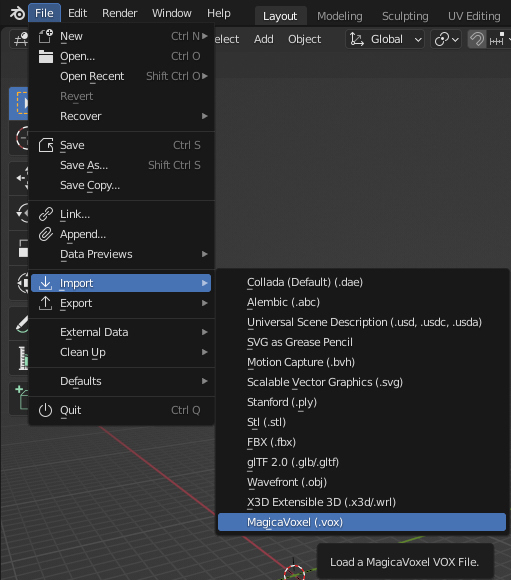

# blender_magicavoxel

Addon for the [Blender](https://www.blender.org) 3D modeling software for loading [MagicaVoxel](https://ephtracy.github.io) VOX files.

## Installation

A detailed description of how to install addons in Blender can be found in the [Blender documentation for installing addons](https://docs.blender.org/manual/en/latest/editors/preferences/addons.html#rd-party-add-ons).

Go to `Edit > Preferences > Add-ons`, click on `Install`, and select `blender_magicavoxel.py`. After that, activate the addon.

## Usage

Go to `File > Import > MagicaVoxel (.vox)` and select the file you want to import.

