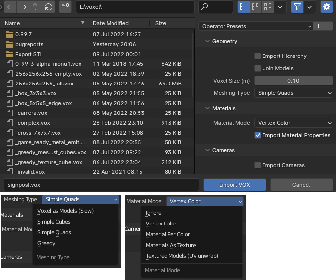

# blender_magicavoxel

Addon for the [Blender](https://www.blender.org) 3D modeling software for
loading [MagicaVoxel](https://ephtracy.github.io) VOX files.

If you enjoy the addon and want to support the maintenance and future development feel free to chip in on [itch.io](https://astralcrowgames.itch.io/blender-magicavoxel-addon).

## 💾 Download

The latest version can be downloaded [here](https://github.com/AstrorEnales/blender_magicavoxel/releases/latest).

## 🧪️ Version Compatibility

The primary goal is the support of the newest version of both MagicaVoxel and Blender. Of course the addon works well
with other versions as well (see [Compatibility](COMPATIBILITY.md)). If you need support for specific (older) versions,
please feel free to create an issue with
the version info.

## 🔧 Installation

Starting with Blender 4.2, the addon can be installed directly inside Blender from the new extensions platform!

A detailed description of how to install addons in Blender can be found in
the [Blender documentation for installing addons](https://docs.blender.org/manual/en/latest/editors/preferences/addons.html#rd-party-add-ons)
.

Go to `Edit > Preferences > Add-ons`, click on `Install`, and select `blender_magicavoxel.py`. After that, activate the
addon.

## ✈️ Usage

Go to `File > Import > MagicaVoxel (.vox)` and select the file you want to import.

### Import Hierarchy

This options determines whether the hierarchy from MagicaVoxel is imported as empty axis objects in blender and all
transformations (translation and rotation) are applied hierarchically. If not, all transformations are calculated
and applied to each model and no hierarchy parent structure is created.

### Join Models

This option allows all models in the MagicaVoxel file to be merged into one. Joining is done on a voxel basis and before
meshing which is superior to just combining the blender meshes for generating the voxel hull and greedy meshing.

### Voxel Size

The voxel size parameter can be used to define the unit voxel size. The example below shows a voxel model imported with
voxel size 1.0, 1.5, and 2.0.

### Material Modes

MagicaVoxel files contain a color palette and additional material properties per color in the palette. This addon
supports different modes how this information is imported.

> ⚠️ Please note: Additional material props are still experimental and under development

| Mode                        | Description                                                                                                                                     |
|-----------------------------|-------------------------------------------------------------------------------------------------------------------------------------------------|
| Ignore                      | Neither colors nor materials are imported.                                                                                                      |
| Vertex Color                | Only the color palette will be imported and assigned to face vertex colors. A simple material is added using the vertex colors as 'Base Color'. |
| Material Per Color          | A material is added per color in the color palette and assigned to the faces material index.                                                    |
| Materials As Texture        | The color palette is created as a 256x1 texture. A simple material is added using this texture.                                                 |
| Textured Models (UV unwrap) | Each model is assigned a material and texture with UV unwrap. (Only usable/sensible for Greedy meshing)                                         |

### Import Material Properties

Depending on the material mode, additional material properties are either added as a separate vertex color layer,
texture, or blender material nodes.

| Mode                               | Description                                                                                                                                               |
|------------------------------------|-----------------------------------------------------------------------------------------------------------------------------------------------------------|
| Vertex Color + Prop                | The color palette and certain material properties are assigned as vertex color layers. A simple material is added using the vertex color layers.          |
| Material Per Color + Prop          | A material is added per color in the color palette and assigned to the faces material index. Additional material properties are stored for each material. |
| Materials As Texture + Prop        | The color palette and certain material properties are created as a 256x1 texture. A simple material is added using these textures.                        |
| Textured Models (UV unwrap) + Prop | Each model is assigned a material and textures with UV unwrap. (Only usable/sensible for Greedy meshing)                                                  |

#### Textured Models (UV unwrap)

To simplify the workflow from MagicaVoxel to "Game Ready" assets the "Textured Models (UV unwrap)" material model
generates textures for base color, emission, roughness, and metallic in combination with UV unwrapping the model faces
onto these textures.

As game assets are generally only sensible as optimized meshes, this material mode is only usable/sensible for the
"Greedy" meshing mode.

### Voxel Hull

This option is only available for certain meshing types and implicitly active for others. If checked, each model is
analyzed to find the voxel hull and all other voxels inside the model are deleted/ignored.

### Meshing Types

This addon supports different methods of representing the loaded voxel models.

#### Voxel as Models

Voxel as models meshing generates a six-sided cube for each voxel as separate models. Depending on the voxel
hull option, cubes are only generated for the hull or all voxels defined in the model.

> ⚠️ Beware that this option may be slow as alot of cube models may be generated!

#### Simple Cubes

Simple cubes meshing generates a six-sided cube for each voxel combined in one mesh per model. Depending on the voxel
hull option, cubes are only generated for the hull or all voxels defined in the model.

#### Simple Quads

Simple quads meshing generates the voxel hull of all models and creates only faces where voxel cube faces are visible
from outside.

#### Greedy

Greedy meshing is equivalent to simple quads as it only creates faces of the voxel hull visible from outside, with the
addition of greedily joining quads where possible.

You may read more about greedy
meshing [here](https://devforum.roblox.com/t/consume-everything-how-greedy-meshing-works/452717)
and [here](https://0fps.net/2012/06/30/meshing-in-a-minecraft-game/).

## Related Works / Feature Comparison

|                         | This                                                                                  | [technistguru/ MagicaVoxel_Importer](https://github.com/technistguru/MagicaVoxel_Importer)    | [RichysHub/ MagicaVoxel-VOX-importer](https://github.com/RichysHub/MagicaVoxel-VOX-importer) | [ldo/ blender_magivox_import](https://github.com/ldo/blender_magivox_import) |
|------------------------:|---------------------------------------------------------------------------------------|--------------------------------------------------------------------------------------------------|-------------------------------------------------------------------------------------------------|---------------------------------------------------------------------------------|
|                  Active | ✅                                                                                     | ❌ [[ref]](https://github.com/technistguru/MagicaVoxel_Importer/issues/2#issuecomment-1020678306) | ~                                                                                               | Last update 06.07.2021                                                          |
|   Supported VOX version | 150, 200                                                                              | 150                                                                                              | 150                                                                                             | 150                                                                             |
|               Hierarchy | ✅                                                                                     | ✅                                                                                                | ❌                                                                                               | ❌                                                                               |
|                Material | WIP (MATT, MATL) [[#1]](https://github.com/AstrorEnales/blender_magicavoxel/issues/1) | ✅ (MATL)                                                                                         | ~ (MATT)                                                                                        | ~ (MATT)                                                                        |
| Textures with UV unwrap | ✅                                                                                     | ❌                                                                                                | ❌                                                                                               | ❌                                                                               |
|                  Camera | WIP [[#3]](https://github.com/AstrorEnales/blender_magicavoxel/issues/3)              | ❌                                                                                                | ❌                                                                                               | ❌                                                                               |
|    Rendering Properties | WIP [[#4]](https://github.com/AstrorEnales/blender_magicavoxel/issues/4)              | ❌                                                                                                | ❌                                                                                               | ❌                                                                               |
|             Join Models | ✅                                                                                     | ❌                                                                                                | ✅                                                                                               | ❌                                                                               |
|             Voxel Scale | ✅                                                                                     | ✅                                                                                                | ✅                                                                                               | ❌                                                                               |
|    Custom Meshing Types | ✅                                                                                     | ❌                                                                                                | ❌                                                                                               | ❌                                                                               |
|    Reduce To Voxel Hull | ✅                                                                                     | ❌                                                                                                | ❌                                                                                               | ❌                                                                               |
