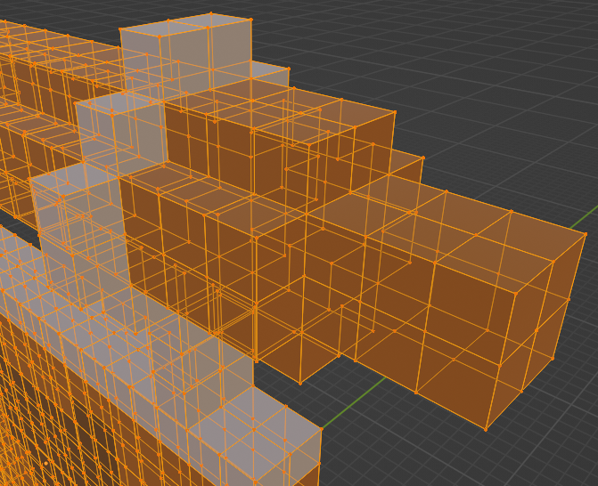

# blender_magicavoxel

Addon for the [Blender](https://www.blender.org) 3D modeling software for
loading [MagicaVoxel](https://ephtracy.github.io) VOX files.

## 🧪️ Version Information

**Please note:** The initial release is tested with Blender 3.0.0 and MagicaVoxel 0.99.7.0 (Beta). More in-depth tests
with different versions will be done in the near future. If you need support for specific (older) versions, please
feel free to create an issue with the version info.

## 💾 Download

The latest version can be downloaded [here](https://github.com/AstrorEnales/blender_magicavoxel/releases/latest).

## 🔧 Installation

A detailed description of how to install addons in Blender can be found in
the [Blender documentation for installing addons](https://docs.blender.org/manual/en/latest/editors/preferences/addons.html#rd-party-add-ons)
.

Go to `Edit > Preferences > Add-ons`, click on `Install`, and select `blender_magicavoxel.py`. After that, activate the
addon.

## ✈️ Usage

Go to `File > Import > MagicaVoxel (.vox)` and select the file you want to import.

### Voxel Colors

Voxel colors are currently imported as vertex color data for each mesh and can be used in materials. For example,
assign a material to the imported models for which the `Base Color` is set to `Vertex Color`.

### Import Hierarchy

This options determines whether the hierarchy from MagicaVoxel is imported as empty axis objects in blender and all
transformations (translation and rotation) are applied hierarchically. If not, all transformations are calculated
and applied to each model and no hierarchy parent structure is created.

### Voxel Size

The voxel size parameter can be used to define the unit voxel size. The example below shows a voxel model imported with
voxel size 1.0, 1.5, and 2.0.

### Voxel Hull

This option is only available for certain meshing types and implicitly active for others. If checked, each model is
analyzed to find the voxel hull and all other voxels inside the model are deleted/ignored.

### Meshing Types

This addon supports different methods of representing the loaded voxel models.

#### Voxel as Models

Voxel as models meshing generates a six-sided cube for each voxel as separate models. Depending on the voxel
hull option, cubes are only generated for the hull or all voxels defined in the model.

> ⚠️ Beware that this option may be slow as alot of cube models may be generated!

#### Simple Cubes

Simple cubes meshing generates a six-sided cube for each voxel combined in one mesh per model. Depending on the voxel
hull option, cubes are only generated for the hull or all voxels defined in the model.

#### Simple Quads

Simple quads meshing generates the voxel hull of all models and creates only faces where voxel cube faces are visible
from outside.

#### Greedy

Greedy meshing is equivalent to simple quads as it only creates faces of the voxel hull visible from outside, with the
addition of greedily joining quads where possible.

You may read more about greedy
meshing [here](https://devforum.roblox.com/t/consume-everything-how-greedy-meshing-works/452717)
and [here](https://0fps.net/2012/06/30/meshing-in-a-minecraft-game/).

## Related Works / Feature Comparison

| Addon                                                                                       | Active                                                                                           | Hierarchy | Materials | Cameras | Join | Voxel scale | VOX version |
|---------------------------------------------------------------------------------------------|--------------------------------------------------------------------------------------------------|-----------|-----------|---------|------|-------------|-------------|
| This                                                                                        | ✅                                                                                                | ✅         | WIP       | WIP     | WIP  | ✅           | 150, 200    |
| [technistguru/MagicaVoxel_Importer](https://github.com/technistguru/MagicaVoxel_Importer)   | ❌ [[ref]](https://github.com/technistguru/MagicaVoxel_Importer/issues/2#issuecomment-1020678306) | ✅         | ✅ (MATL)  | ❌       | ❌    | ✅           | 150         |
| [RichysHub/MagicaVoxel-VOX-importer](https://github.com/RichysHub/MagicaVoxel-VOX-importer) | Last update 29.10.2019                                                                           | ❌         | ~ (MATT)  | ❌       | ✅    | ✅           | 150         |
| [ldo/blender_magivox_import](https://github.com/ldo/blender_magivox_import)                 | Last update 06.07.2021                                                                           | ❌         | ~ (MATT)  | ❌       | ❌    | ❌           | 150         |
